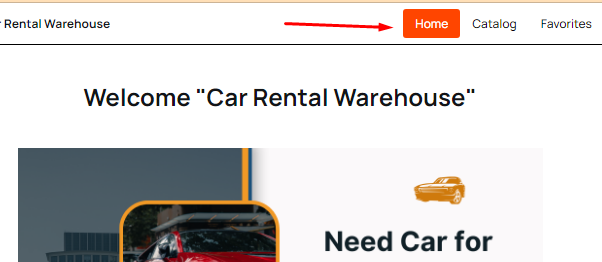
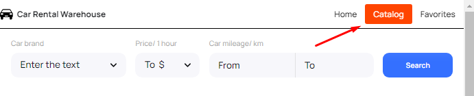
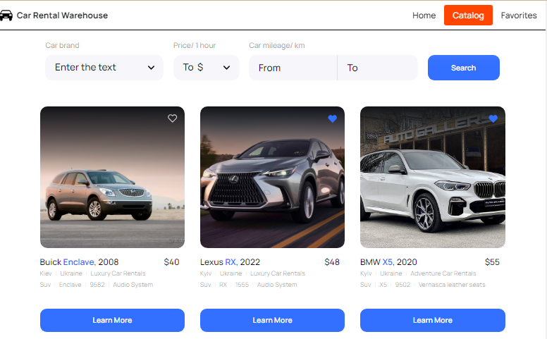
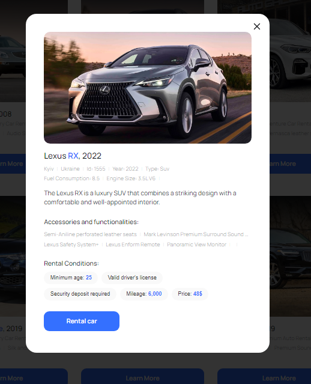
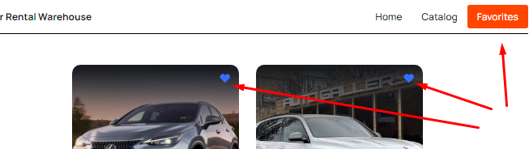

# RentalCar 
"RentalCar" rental car application is developed as a test application for car rental in Ukraine.
[Site on Github Page](https://ivashkavip.github.io/RentalCar/). 

### the following technologies were used in the development:
**HTML+CSS, Styled Components, Java-Script, ReactJS, Redux-Toolkit (bold)** 
"Load More" pagination was implemented
[Mockapi.io](https://mockapi.io/) service was used as a backend

### a few words about the structure :  
for the time being used as a decorative element and will be finalised

### "Catalog" page
the main functional page, where you can select the car you are interested in, both for rent and for the wish list.

### major components
- is a filter component that allows you to select three different filters to display the list of cars.
- Add/remove from "favorites". 
- View detailed information about the vehicle by clicking "Learn More".

### modal window
allows you to see detailed information about the selected car. 
You can also make a "call" to rent it. (pressing "Rental Car")

### "Favorites" page 
displays selected cars in the wish list
You can remove an item by clicking on the "heart".

